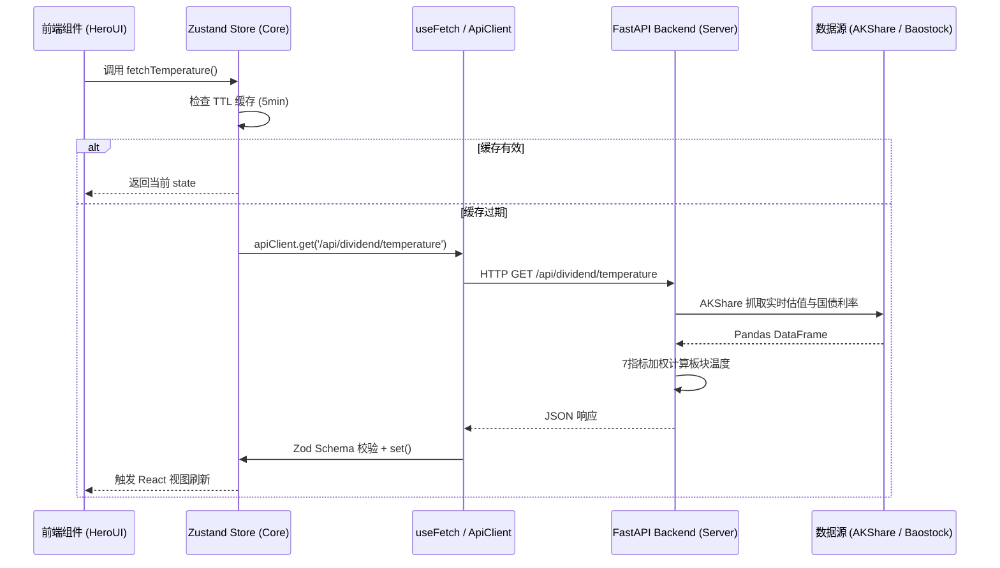

# InvestScope 系统架构与技术设计文档

本文档详细说明 InvestScope 项目的技术选型、Monorepo 包分层架构、状态管理策略与 UI/CSS 设计规范。

---

## 1. 架构总览

InvestScope 参考了轻量级 Monorepo 项目 `multica` 的包隔离哲学，采用 **pnpm workspace + Turborepo** 进行统一管理：

```
                              ┌────────────────────────────────────────┐
                              │          apps/web                      │
                              │   (Next.js 16 App Router)              │
                              └──────────────────┬─────────────────────┘
                                                 │
                                ┌────────────────┴────────────────┐
                                ▼                                 ▼
                    ┌──────────────────────┐          ┌──────────────────────┐
                    │   packages/views     │          │    packages/core     │
                    │   (共享业务视图)     │─────────►│  (Zustand + API)     │
                    └───────────┬──────────┘          └───────────┬──────────┘
                                │                                 │
                                ▼                                 ▼
                    ┌──────────────────────┐          ┌──────────────────────┐
                    │    packages/ui       │          │    packages/data     │
                    │ (HeroUI + ECharts)   │          │ (Zod Schemas + 算法) │
                    └──────────────────────┘          └──────────────────────┘
                                                                  │
                                                                  ▼
                                                      ┌──────────────────────┐
                                                      │    server/           │
                                                      │ (Python FastAPI)     │
                                                      └──────────────────────┘
```

---

## 2. 包层级职责与隔离规则

为了保证代码的清洁性与跨平台（未来支持 Electron 桌面端和 Expo 移动端）的可复用性，制定以下**强隔离规则**：

| 包路径 | 职责定位 | 禁止事项 |
|:---|:---|:---|
| `apps/web` | Next.js 壳层、路由（`app/`）、页面入口 | 禁止存放核心业务计算逻辑 |
| `packages/views` | 跨端可复用的业务页面/图表组件 | 禁止包含平台专属 API (如 `next/navigation`) |
| `packages/ui` | 原子 UI 封装、HeroUI 主题补丁、ECharts 基础图表 | **禁止引入** `@investscope/core` 或写业务 API 调用 |
| `packages/core` | 无头业务逻辑、Zustand 全局 Store、`useFetch` Hook、ApiClient | **禁止引入** `react-dom`、`localStorage` 或 UI 样式库 |
| `packages/data` | 数据 Schema (Zod)、数据适配器、纯前端/后端计算引擎 | **纯 JS/TS 纯函数**，禁止引入 React 或 DOM |
| `server/` | Python FastAPI 后端，负责在线数据源（AKShare/Baostock）采集与计算 | 保持轻量高效 |

---

## 3. 前端与状态管理策略

### 3.1 取消 TanStack Query，采用 Zustand + 自定义 Fetch Hook
为了保持前端架构简洁明了，没有引入重量级的 TanStack Query，而是采用 **Zustand Store + TTL 缓存** 策略：

- **缓存与失效 (TTL)**：在 `market-store` 和 `dividend-store` 中内置 5-10 分钟的时效机制（`CACHE_MS`），避免重复请求。
- **自定义 Hook (`useFetch` / `useIntervalFetch`)**：封装通用的请求状态 (`data`, `loading`, `error`, `refetch`) 以及轮询能力。

```typescript
// packages/core/hooks/use-fetch.ts
export function useFetch<T>(
  fetcher: () => Promise<T>,
  deps: unknown[] = [],
  options: UseFetchOptions = {}
): UseFetchReturn<T>;
```

### 3.2 UI 组件与样式规范

- **组件库**：**HeroUI v3.2.4** (原 NextUI，基于 Tailwind CSS v4 + React Aria Components)
- **主题管理**：使用 `next-themes` 驱动，根据 HTML 上的 `data-theme="dark"` 切换全套玻璃拟态 (Glassmorphism) 主题。
- **视觉风格**：
  - 透明模糊毛玻璃面板：`.glass-panel`
  - 动态温度渐变色条：`.temperature-gradient`
  - 金融涨跌红绿对比：`text-rise` (#ef4444) / `text-fall` (#22c55e)

---

## 4. 数据流设计

所有外部数据查询与交互流程如下：


