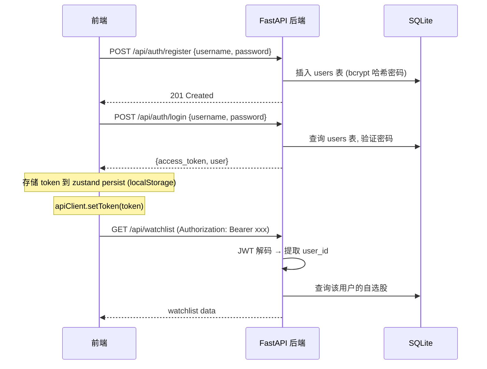

# 用户系统与个人化功能设计文档

本文档说明 InvestScope 用户系统的整体设计，包含认证方案、数据库表结构、API 设计与前端状态管理规划。

---

## 1. 设计背景

当前系统无用户概念，所有持仓数据共享一张全局 `holdings` 表。为支持以下个人化功能，需引入用户系统：

- **自选股**：用户收藏关注的股票，实时行情批量推送
- **红利组合**：用户可创建多个投资组合，独立管理持仓与再平衡
- **个性化设置**：刷新频率、策略偏好等配置绑定到用户

---

## 2. 认证方案：JWT 本地认证

### 选型理由

| 考量 | 决定 |
|------|------|
| 项目性质 | 个人投资工具，无需社交登录 |
| 前端现状 | `ApiClient` 已预留 `setToken()` + `Bearer` 头，零改动 |
| 后端现状 | FastAPI 原生支持 `OAuth2PasswordBearer` |
| WebSocket 鉴权 | JWT 可通过 query param 传入 WS 连接 |

### 认证流程



### 依赖新增

```
# server/requirements.txt 新增
python-jose[cryptography]>=3.3.0    # JWT 编解码
passlib[bcrypt]>=1.7.4              # 密码哈希
```

---

## 3. 数据库设计

### 新增表结构

```sql
-- ─── 用户表 ─────────────────────────────────────────────────
CREATE TABLE users (
    id          TEXT PRIMARY KEY,              -- UUID
    username    TEXT UNIQUE NOT NULL,          -- 登录用户名
    email       TEXT UNIQUE,                  -- 可选邮箱
    hashed_pwd  TEXT NOT NULL,                -- bcrypt 哈希密码
    nickname    TEXT,                          -- 显示昵称
    avatar_url  TEXT,                          -- 头像 URL
    created_at  TEXT NOT NULL DEFAULT (datetime('now')),
    updated_at  TEXT NOT NULL DEFAULT (datetime('now'))
);

-- ─── 自选股表 ───────────────────────────────────────────────
CREATE TABLE watchlist (
    id          TEXT PRIMARY KEY,              -- UUID
    user_id     TEXT NOT NULL,
    code        TEXT NOT NULL,                -- 股票代码 e.g. "600519"
    name        TEXT,                          -- 冗余股票名称
    sort_order  INTEGER DEFAULT 0,             -- 用户自定义排序
    added_at    TEXT NOT NULL DEFAULT (datetime('now')),
    FOREIGN KEY (user_id) REFERENCES users(id),
    UNIQUE(user_id, code)                     -- 同一用户不能重复收藏
);

-- ─── 红利组合表（用户可创建多个） ───────────────────────────
CREATE TABLE portfolios (
    id          TEXT PRIMARY KEY,              -- UUID
    user_id     TEXT NOT NULL,
    name        TEXT NOT NULL DEFAULT '我的红利组合',
    description TEXT,
    target_allocation TEXT,                   -- JSON: {"core":60,"satellite":30,"reserve":10}
    created_at  TEXT NOT NULL DEFAULT (datetime('now')),
    updated_at  TEXT NOT NULL DEFAULT (datetime('now')),
    FOREIGN KEY (user_id) REFERENCES users(id)
);

-- ─── 组合持仓表（替代现有 holdings 表） ─────────────────────
CREATE TABLE portfolio_holdings (
    id              TEXT PRIMARY KEY,
    portfolio_id    TEXT NOT NULL,
    code            TEXT NOT NULL,
    name            TEXT NOT NULL,
    category        TEXT NOT NULL,
    shares          REAL NOT NULL,
    cost_price      REAL NOT NULL,
    current_price   REAL NOT NULL,
    added_at        TEXT NOT NULL DEFAULT (datetime('now')),
    FOREIGN KEY (portfolio_id) REFERENCES portfolios(id) ON DELETE CASCADE
);
```

### ER 关系

```
users ──1:N──► watchlist           (一个用户有多只自选)
users ──1:N──► portfolios          (一个用户有多个组合)
portfolios ──1:N──► portfolio_holdings  (一个组合有多笔持仓)
```

### 现有 holdings 表迁移策略

1. 创建 `users` 表 → 插入默认用户
2. 创建 `portfolios` 表 → 为默认用户创建默认组合
3. 创建 `portfolio_holdings` 表 → 迁移老 `holdings` 数据
4. 老 `holdings` 表保留作为备份，新代码全部指向 `portfolio_holdings`

---

## 4. 后端 API 设计

### 认证 API

| 方法 | 路径 | 说明 | 鉴权 |
|------|------|------|------|
| POST | `/api/auth/register` | 注册 `{username, password}` | 公开 |
| POST | `/api/auth/login` | 登录，返回 `{access_token, user}` | 公开 |
| GET | `/api/auth/me` | 获取当前用户信息 | Bearer |
| PUT | `/api/auth/me` | 更新昵称/头像 | Bearer |

### 自选股 API

| 方法 | 路径 | 说明 | 鉴权 |
|------|------|------|------|
| GET | `/api/watchlist` | 获取我的自选股列表 | Bearer |
| POST | `/api/watchlist` | 添加自选 `{code, name}` | Bearer |
| DELETE | `/api/watchlist/{code}` | 移除自选 | Bearer |
| PUT | `/api/watchlist/reorder` | 拖拽排序 `{codes: [...]}` | Bearer |

### 组合 API（替代现有 `/api/portfolio`）

| 方法 | 路径 | 说明 | 鉴权 |
|------|------|------|------|
| GET | `/api/portfolios` | 获取我的所有组合 | Bearer |
| POST | `/api/portfolios` | 创建新组合 | Bearer |
| GET | `/api/portfolios/{id}/summary` | 组合概览（含实时市值） | Bearer |
| POST | `/api/portfolios/{id}/holdings` | 向组合添加持仓 | Bearer |
| DELETE | `/api/portfolios/{id}/holdings/{hid}` | 删除持仓 | Bearer |
| GET | `/api/portfolios/{id}/rebalance-signals` | 再平衡信号 | Bearer |

### 鉴权中间件模式

```python
from fastapi import Depends
from fastapi.security import OAuth2PasswordBearer

oauth2_scheme = OAuth2PasswordBearer(tokenUrl="/api/auth/login")

def get_current_user(token: str = Depends(oauth2_scheme)) -> User:
    """解码 JWT，返回当前用户，失败抛 401"""
    payload = jwt.decode(token, SECRET_KEY, algorithms=["HS256"])
    user = db.get_user(payload["sub"])
    if not user:
        raise HTTPException(status_code=401)
    return user

# 使用：
@router.get("/watchlist")
def get_watchlist(user: User = Depends(get_current_user)):
    return db.get_watchlist(user.id)
```

---

## 5. 前端设计

### 新增 Store

| Store | 文件 | 职责 |
|-------|------|------|
| `useAuthStore` | `packages/core/stores/auth-store.ts` | token、user、login、register、logout，persist 到 localStorage |
| `useWatchlistStore` | `packages/core/stores/watchlist-store.ts` | 自选股列表 CRUD |

### 新增页面

| 页面 | 路径 | 说明 |
|------|------|------|
| 登录页 | `apps/web/app/login/page.tsx` | 用户名+密码登录表单 |
| 注册页 | `apps/web/app/register/page.tsx` | 注册表单 |
| 自选股看板 | `apps/web/app/watchlist/page.tsx` | 自选股列表 + QuoteHub 实时行情 |

### 路由保护

```
公开页面:   /login, /register
需要登录:   /, /dividend/*, /watchlist, /portfolio, /market, /settings
```

### Sidebar 变化

- 新增「我的自选」导航项
- 底部区域：未登录 → "登录"入口；已登录 → 用户头像 + 昵称 + 退出

### 自选股与 QuoteHub 联动

自选股列表页直接复用已有的 WebSocket 行情订阅机制 (`useQuoteWs`)，无需后端改动：

```typescript
// watchlist/page.tsx
const watchlist = useWatchlistStore(s => s.items);
const { quotes, subscribe, unsubscribe } = useQuoteWs();

useEffect(() => {
  const codes = watchlist.map(w => w.code);
  subscribe(codes);
  return () => unsubscribe(codes);
}, [watchlist]);
```

---

## 6. 分阶段交付计划

### 阶段 1：认证基础
- 后端：`users` 表 + 注册/登录 API + JWT 鉴权中间件
- 前端：`auth-store` + 登录/注册页 + Sidebar 用户状态
- 数据迁移：老 holdings 关联到默认用户

### 阶段 2：自选股
- 后端：`watchlist` 表 + CRUD API
- 前端：`watchlist-store` + 自选股列表页 + 实时行情
- 个股详情页增加「加自选」按钮

### 阶段 3：多组合管理
- 后端：`portfolios` + `portfolio_holdings` 表
- 前端：组合创建/切换 UI
- 老 `/portfolio` 页面适配多组合
